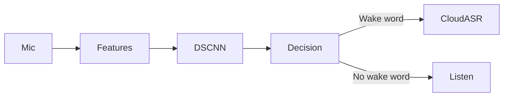

# Voicewave

> An edge-based wake-word detection system for low-power embedded devices using **ESP32-S3**, **TensorFlow Lite for Microcontrollers (TFLM)**, and a custom TinyML wake-word model.

> **Note:** This is a shortened README generated from the conversation context. You can expand it later.

## Overview

Voicewave performs custom wake-word detection locally on an ESP32-S3 using TensorFlow Lite for Microcontrollers. Once the wake word is detected, the device is intended to stream subsequent speech to a cloud ASR service instead of continuously transmitting audio.

## Key Features

- ESP32-S3 deployment
- ESP-IDF + FreeRTOS
- TensorFlow Lite Micro inference
- DS-CNN wake-word model
- INT8 quantization
- MFCC / Log-Mel preprocessing
- 48 KB lock-free pre-roll ring buffer
- Multi-frame output smoothing
- Google Colab training pipeline
- Manifest-based dataset processing
- Cloud ASR handoff

## System Architecture

## Hardware

| Component | Purpose |
|-----------|---------|
| ESP32-S3 | Edge inference |
| INMP441 *(planned)* | I2S microphone |

## Software Stack

- ESP-IDF
- FreeRTOS
- TensorFlow Lite for Microcontrollers
- C++
- Python
- Google Colab

## Performance

| Metric | Current |
|---------|---------|
| CPU Clock | 160 MHz |
| Measured Inference Latency | ~353 ms |

Latency is measured using `esp_timer` around `interpreter->Invoke()`.

## Memory

- 48 KB lock-free pre-roll ring buffer
- ~30 KB Tensor Arena (current reference)

## Current Status

Implemented:
- Dataset pipeline
- INT8 quantization workflow
- TFLM deployment
- Ring buffer
- Multi-frame smoothing
- Memory profiling
- Latency benchmarking

In Progress:
- INMP441 integration
- Final model validation
- ESP-NN optimization (post-presentation)

## License

This project's license has not yet been finalized.
